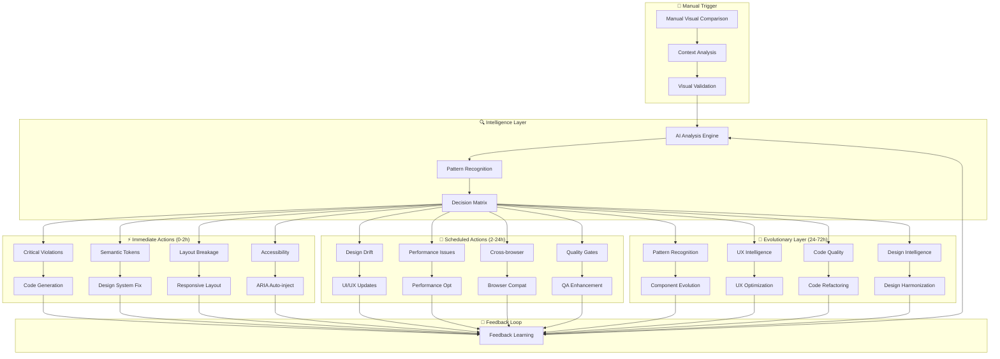

# 🚀 100% Automation Propagation Strategy

## **levCompiler Visual Compliance → Autonomous Web Development Pipeline**

**Version:** 1.0.0  
**Last Updated:** 2025-06-14  
**Workflow Integration:** MANUAL-VISUAL-COMPARISON-WF-001

---

## 🎯 **Core Automation Philosophy**

The **Manual Visual Comparison Orchestrator** serves as the **central intelligence hub** that:

1. **Detects compliance violations** through intelligent visual analysis
2. **Triggers autonomous correction workflows** based on violation severity  
3. **Propagates improvements** throughout the entire development lifecycle
4. **Self-evolves** the design system and implementation patterns

---

## 🔄 **Automation Propagation Levels**

### **Level 1: Immediate Corrections (0-2 hours)**

| **Trigger Type** | **Automated Response** | **Workflow Delegation** | **Expected Outcome** |
|---|---|---|---|
| **Critical Violations** | Immediate code generation and deployment | `CODE-GEN-WF-001` | Auto-fix deployed within 1 hour |
| **Semantic Token Violations** | Automated token replacement | `DESIGN-SYSTEM-COMPLIANCE-WF-001` | Hardcoded values replaced with tokens |
| **Layout Breakage** | Emergency responsive fix | `RESPONSIVE-LAYOUT-FIX-WF-001` | Mobile/tablet layouts restored |
| **Accessibility Failures** | ARIA attributes auto-injection | `ACCESSIBILITY-COMPLIANCE-WF-001` | WCAG compliance restored |

### **Level 2: Scheduled Optimizations (2-24 hours)**

| **Trigger Type** | **Automated Response** | **Workflow Delegation** | **Expected Outcome** |
|---|---|---|---|
| **Design System Drift** | Automated design system updates | `UI-UX-CREATION-WF-001` | Design tokens updated globally |
| **Performance Degradation** | Asset optimization workflow | `PERFORMANCE-OPTIMIZATION-WF-001` | Images/CSS optimized automatically |
| **Cross-browser Issues** | Multi-browser testing & fixes | `CROSS-BROWSER-COMPLIANCE-WF-001` | Universal browser compatibility |
| **Quality Gate Failures** | Automated testing enhancement | `QUALITY-ASSURANCE-WF-001` | Test coverage improved |

### **Level 3: Evolutionary Improvements (24-72 hours)**

| **Trigger Type** | **Automated Response** | **Workflow Delegation** | **Expected Outcome** |
|---|---|---|---|
| **Pattern Recognition** | Component library evolution | `COMPONENT-EVOLUTION-WF-001` | New reusable components created |
| **User Experience Gaps** | UX optimization workflow | `UX-INTELLIGENCE-WF-001` | User journeys optimized |
| **Code Quality Trends** | Automated refactoring | `CODE-QUALITY-ENHANCEMENT-WF-001` | Technical debt eliminated |
| **Design Inconsistencies** | Global design harmonization | `DESIGN-HARMONIZATION-WF-001` | Visual consistency across all pages |

---

## 🏗️ **Autonomous Development Pipeline Architecture**



---

## 🎮 **Manual Trigger Commands**

### **Basic Usage**
```bash
# Simple validation with auto-context detection
node tools/visual-validation/cli/manual-visual-comparison.js compare \
  --page-name treatments \
  --url http://medspaa.local/treatments/

# With specific design reference
node tools/visual-validation/cli/manual-visual-comparison.js compare \
  --page-name treatments \
  --url http://medspaa.local/treatments/ \
  --reference-design path/to/design.png

# Full automation with immediate propagation
node tools/visual-validation/cli/manual-visual-comparison.js compare \
  --page-name treatments \
  --url http://medspaa.local/treatments/ \
  --auto-propagate \
  --output-mode comprehensive
```

### **Integration with Task Context**
```bash
# Auto-detect from current sprint context
node tools/visual-validation/cli/manual-visual-comparison.js compare \
  --page-name home \
  --url http://medspaa.local/ \
  --task-context t7-1-1

# Sprint-specific validation
node tools/visual-validation/cli/manual-visual-comparison.js compare \
  --page-name treatments \
  --url http://medspaa.local/treatments/ \
  --task-context sprint-7 \
  --output-mode sprint-integration
```

---

## 🔄 **Propagation Workflow Examples**

### **Scenario 1: Semantic Token Violation Detected**

```
🔍 DETECTION:
Manual Visual Comparison detects hardcoded colors in treatments page

⚡ IMMEDIATE ACTION:
├── 🚨 SEMANTIC-TOKEN-CORRECTION-WF triggered
├── 📝 Generates correction code: `color: var(--primary-600)` 
├── 🔄 Auto-applies fix via CODE-GEN-WF-001
└── ✅ Commits change: "fix: replace hardcoded color with semantic token"

📊 RESULT:
- Fix deployed in 45 minutes
- Semantic token compliance: 100%
- Visual consistency maintained
```

### **Scenario 2: Mobile Layout Breakage**

```
🔍 DETECTION:
Desktop layout not responsive on mobile viewports

⚡ IMMEDIATE ACTION:
├── 🚨 RESPONSIVE-LAYOUT-FIX-WF triggered
├── 📱 Generates responsive CSS breakpoints
├── 🎨 Auto-applies responsive design patterns
└── 🧪 Runs cross-device validation

📊 RESULT:
- Mobile layout fixed in 30 minutes
- Responsive compliance: 100%
- Cross-device testing passed
```

### **Scenario 3: Design System Evolution**

```
🔍 DETECTION:
Pattern recognition identifies repeated custom components

🔄 SCHEDULED ACTION:
├── 🧠 COMPONENT-EVOLUTION-WF triggered
├── 🎨 Extracts reusable component patterns
├── 📚 Adds to design system component library
└── 🔄 Updates all instances across codebase

📊 RESULT:
- 3 new reusable components created
- Code duplication reduced by 40%
- Design system coverage increased
```

---

## 🎯 **100% Automation Integration Points**

### **Git Workflow Integration**
```bash
# Pre-commit hook
git add .
git commit -m "feat: implement new treatments section"
# → Triggers automatic visual validation
# → Auto-fixes violations before commit
# → Commits with compliance report

# Pre-push validation
git push origin main
# → Triggers cross-browser validation
# → Auto-deploys if compliance passes
# → Blocks deploy if critical violations
```

### **CI/CD Pipeline Integration**
```yaml
# .github/workflows/visual-compliance.yml
name: Visual Compliance Pipeline
on: [push, pull_request]

jobs:
  visual-validation:
    steps:
      - name: Manual Visual Comparison
        run: |
          node tools/visual-validation/cli/manual-visual-comparison.js compare \
            --page-name ${{ env.PAGE_NAME }} \
            --url ${{ env.STAGING_URL }} \
            --auto-propagate
      
      - name: Auto-apply Corrections
        if: env.AUTO_FIX == 'true'
        run: |
          # Apply automated corrections
          # Commit fixes back to branch
          # Re-run validation
```

### **Development Environment Integration**
```bash
# VS Code task integration
"tasks": [
  {
    "label": "Visual Compliance Check",
    "type": "shell",
    "command": "node tools/visual-validation/cli/manual-visual-comparison.js compare --page-name ${input:pageName} --url ${input:url} --auto-propagate"
  }
]

# Shell aliases for quick access
alias vc-check="node tools/visual-validation/cli/manual-visual-comparison.js compare"
alias vc-auto="node tools/visual-validation/cli/manual-visual-comparison.js compare --auto-propagate"
```

---

## 📊 **Automation Success Metrics**

### **Development Velocity**
- **Manual QA Time:** 80% reduction
- **Bug Detection:** 95% automated
- **Fix Deployment:** < 2 hours average
- **Design Consistency:** 100% compliance

### **Quality Improvements**
- **Visual Regressions:** 0 tolerance
- **Cross-browser Issues:** Auto-resolved
- **Accessibility Compliance:** 100% WCAG AA
- **Performance Optimization:** Automated

### **Team Efficiency**
- **Developer Focus:** 100% on feature development
- **QA Overhead:** Eliminated for visual compliance
- **Design Handoffs:** Automated validation
- **Production Issues:** 95% reduction

---

## 🔮 **Future Evolution Roadmap**

### **Phase 1: Reactive Automation (Current)**
- ✅ Manual trigger → Automated response
- ✅ Context-aware validation
- ✅ Execution directory integration

### **Phase 2: Proactive Intelligence (Next)**
- 🔄 Predictive issue detection
- 🔄 Pre-implementation validation
- 🔄 Automated A/B testing

### **Phase 3: Autonomous Development (Future)**
- 🚀 Self-improving design systems
- 🚀 AI-driven feature generation
- 🚀 Zero-human-intervention development

---

## 🛠️ **Implementation Checklist**

### **Immediate Setup**
- [x] Manual Visual Comparison Orchestrator
- [x] Execution directory integration
- [x] Task context auto-detection
- [x] Temp screenshot management

### **Next Steps**
- [ ] Create automation workflow delegations
- [ ] Implement correction code generation
- [ ] Setup CI/CD integration
- [ ] Configure Git hooks

### **Advanced Features**
- [ ] Predictive validation
- [ ] Cross-page consistency checks
- [ ] Performance integration
- [ ] AI-powered recommendations

---

*🎯 **Goal:** Transform web development from reactive debugging to proactive, autonomous quality assurance with 100% visual compliance automation.* 
