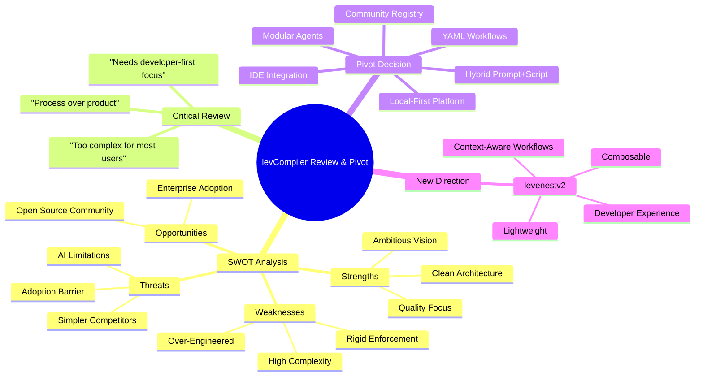

# Decision Mindmap: From levCompiler to levenestv2

```mermaid
mindmap
  root((levCompiler Review & Pivot))
    SWOT Analysis
      Strengths
        Ambitious Vision
        Clean Architecture
        Quality Focus
      Weaknesses
        Over-Engineered
        Rigid Enforcement
        High Complexity
      Opportunities
        Enterprise Adoption
        Open Source Community
      Threats
        Adoption Barrier
        AI Limitations
        Simpler Competitors
    Critical Review
      "Too complex for most users"
      "Process over product"
      "Needs developer-first focus"
    Pivot Decision
      Local-First Platform
      IDE Integration
      YAML Workflows
      Modular Agents
      Hybrid Prompt+Script
      Community Registry
    New Direction
      levenestv2
        Lightweight
        Composable
        Developer Experience
        Context-Aware Workflows
``` 
