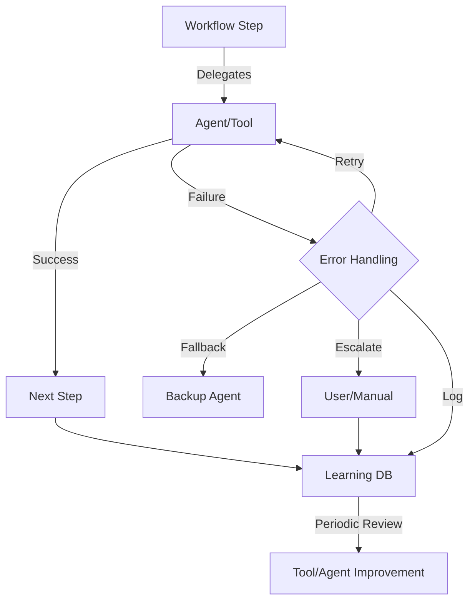

# Phased Learning & Improvement Strategy for Agents and Workflows

## Overview
To ensure agents and workflows in levenestv2 continuously improve, we adopt a phased learning and improvement strategy. This approach balances privacy, developer control, and the power of community-driven evolution.

---

## Phase 1: Self-Learning (Local, Private)
**Why?**
- Early users are few; privacy and trust are paramount.
- Fast iteration and debugging without data sharing concerns.

**How?**
- Each agent/workflow logs its own successes, failures, errors, and user feedback to a local database or file (e.g., SQLite, JSONL).
- Agents/workflows can analyze their own logs to:
  - Adjust prompts or parameters
  - Suggest improvements to the user
  - Flag recurring issues for manual review
- Users have full control and transparency over their own learning data.
- Manual review of logs to identify patterns and make improvements.

**Benefits:**
- No privacy concerns.
- Fast, developer-centric iteration.
- Early adopters have control and transparency.

---

## Phase 2: Opt-In Community Logging (Aggregated, Anonymized)
**When to Switch?**
- As the user base grows and community-driven improvement becomes valuable.

**How?**
- Users can opt-in to share anonymized logs/feedback with a central server.
- Aggregated data is analyzed to identify:
  - Most common errors
  - Most/least effective agents/workflows
  - Feature requests and pain points
- Community insights are surfaced to all users.

**Benefits:**
- Faster, broader improvement.
- Community-driven evolution.
- Privacy is respected (opt-in, anonymized).

---

## Phase 3: Evolved, Community-Driven Agents/Workflows
**How?**
- Release improved versions of agents/workflows based on aggregated learnings.
- Clearly communicate improvements and changelogs.
- Continue the feedback loop with transparency and user control.
- Optionally, recognize contributors or top feedback providers.

**Benefits:**
- The platform gets smarter for everyone.
- Community engagement and ownership.
- Focus on high-impact improvements.

---

## Best Practices
- **Transparency:** Always inform users about what is logged and how it is used.
- **Privacy:** Default to local/self-learning; make community logging opt-in and anonymized.
- **Actionability:** Use collected data to drive real improvements and communicate changes.
- **Modularity:** Make learning/logging pluggable and user-controllable.

---

## Summary Table
| Phase      | Learning Scope | Data Location | User Control | Community Value | When to Use                |
|------------|---------------|---------------|--------------|----------------|----------------------------|
| 1. Self    | Per-user      | Local         | Full         | Low            | Early, few users           |
| 2. Opt-in  | Aggregated    | Central       | Opt-in       | Medium/High    | Growing user base          |
| 3. Evolved | Global        | Central       | Opt-in       | High           | Mature, active community   |

---

## Visual: Delegation & Learning Flow

---

## TL;DR
- **Start with self-learning, local-only logging and improvement.**
- **Add opt-in, anonymized community logging as your user base grows.**
- **Release improved agents/workflows based on real-world data and feedback.**
- **Always prioritize transparency, privacy, and actionable improvement.** 
